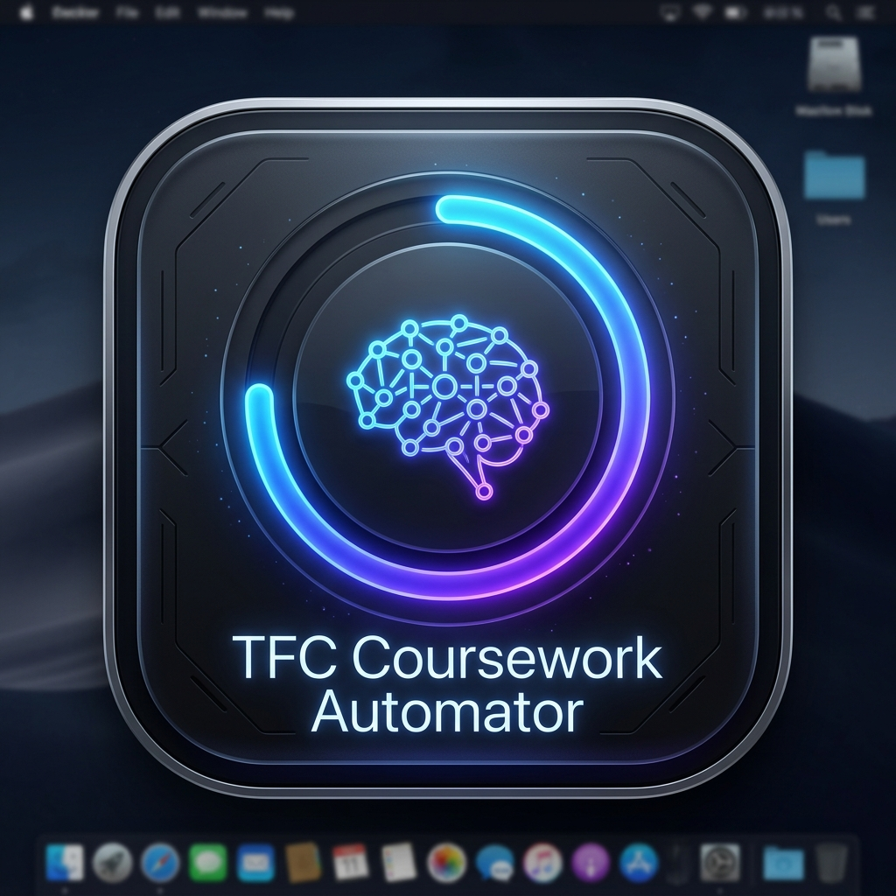
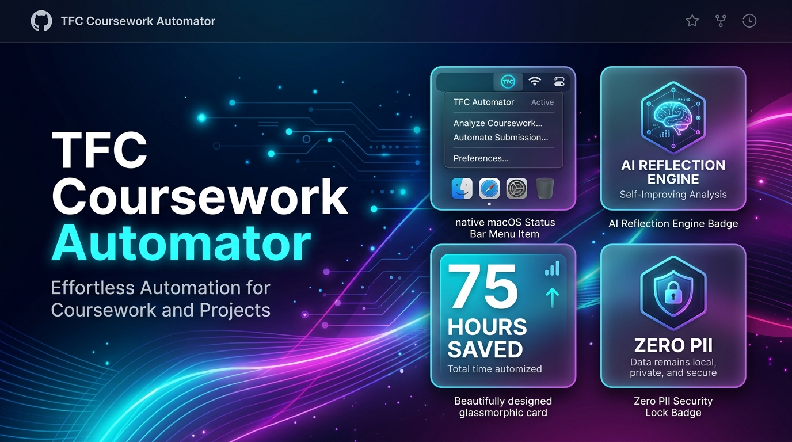
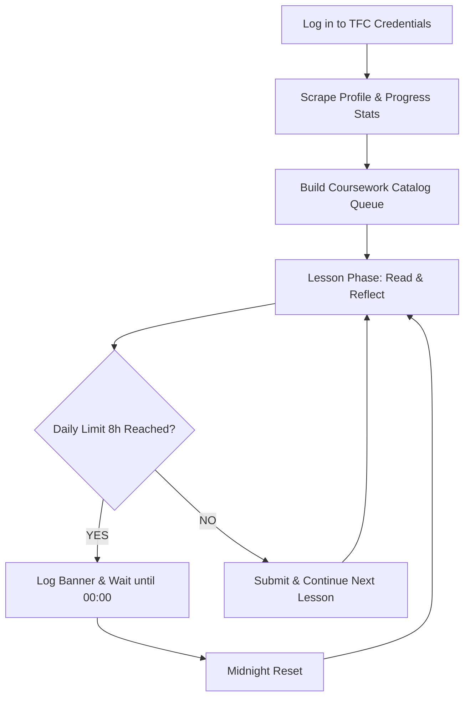

<div align="center">
  

  # 🚀 Foundation of Change Coursework Automator

  

  <p align="center">
    <a href="https://www.python.org/"></a>
    <a href="https://playwright.dev/python/"></a>
    <a href="https://deepmind.google/technologies/gemini/"></a>
    <a href="LICENSE"></a>
    <a href="#-privacy--security-guarantee"></a>
    <a href="ROADMAP.md"></a>
  </p>

  **An intelligent, hands-free automation suite that completes CBT community service coursework on [The Foundation of Change](https://www.thefoundationofchange.org).**
  <br/>
  *It automatically handles initial reading timers, generates authentic AI reflections, manages submit-lock timers, keeps sessions active, and enforces daily hour limits—saving you 75+ hours of tedious manual clicking.*

</div>

---

## 🌟 Why Use This Automator?

Completing 75 required hours of community service coursework manually is exhausting. You are forced to deal with:
- ⏳ Sitting through **hundreds of 30–60 minute reading and reflection timers**.
- 🖱️ Constantly clicking and scrolling every 2–3 minutes to prevent frustrating session logouts.
- ✍️ Writing hundreds of unique reflection responses under strict character-length restrictions.
- ⏰ Tracking complex daily hour caps (8.0h/day) to ensure no effort is wasted.

### 💡 The Solution: Zero Effort, High Impact

This bot automates the entire coursework lifecycle end-to-end:
1. **Save 75+ Hours**: Let the bot run silently in the background while you study, work, or sleep.
2. **Instant Submissions**: AI reflections are generated in the background *while* reading timers run, so forms submit the exact second timers reach zero.
3. **Set-and-Forget Resilience**: Includes an auto-recovery wrapper that handles network glitches, auto-logs back in, and waits out daily limits until midnight automatically.

---

## 🖥️ Program Demonstration & Live UI

### 1. User Profile & Account Summary Banner
Upon login, the automator scrapes and displays a complete profile and coursework progress audit:

```text
============================================================
👤 USER ACCOUNT PROFILE & EDIT PROFILE DETAILS
============================================================
• FULL NAME                     : Jane Doe
• EMAIL (READ-ONLY)             : user@example.com
• DATE OF BIRTH                 : 2000-01-01
• COMMUNITY SERVICE RELATED TO  : General / Personal Growth
• OVERALL PROGRESS              : 18.8h / 75.0h total (25% Complete)
• HOURS REMAINING               : 56.2h
============================================================
```

### 2. Live Terminal & Title Bar Status Line
Real-time progress updates appear directly in your terminal line and window title bar:

```text
TFC done:3+1 · #4/29 READ 29:45 · Crime Prevention · today 1.5/8h · all 18.8/75h · left 6.5h
```

### 3. Automatic Daily Limit Notification & Midnight Wait
When the platform's 8.0h/day limit is reached, the bot notifies you, enters a low-resource waiting state with a live midnight countdown, and automatically resumes coursework when the new day starts:

```text
============================================================
⛔ DAILY LIMIT REACHED ON PLATFORM (8.0h / 8.0h max for today)
📅 Today's Logged Hours: 8.0h
📊 Overall Progress: 18.8h / 75.0h total
🔔 USER NOTIFICATION: Daily limit reached. Bot will wait for reset and resume automatically.
⏰ Next reset estimated at local midnight (2026-07-26 00:00:00).
⏳ Time until reset: 09h 33m 00s
============================================================
🌙 [LIMIT_WAIT] ⏱ 09h 33m remaining until daily reset (00:00:00). Waiting...
```

### 4. Native macOS Menu Bar Status App 🍏
Prefer a clean menu bar interface? Launch `./run_menubar.sh` for a lightweight macOS status bar app (`menubar.py`) that lives in your top panel:
- **Live Menu Title**: Shows current lesson & timer (e.g. `📖 29m 45s | 18.8/75h` or `🌙 Reset in 09h 15m`).
- **Active Timers Submenu**: Track Article Reading, Submit-Lock, and Daily Limit Reset timers simultaneously.
- **Upcoming AI Reflection Draft**: Preview the pre-generated AI essay and copy it to your clipboard with 1 click (`📋 Copy Reflection`).
- **1-Click Control**: Toggle the bot process on/off directly from the menu bar (`▶️ Start Automator` / `⏸️ Stop Automator`).
- **Live History**: Scrollable history of the latest completed lessons and progress events.

---

## ✨ Key Features Breakdown

| Feature | Description |
| :--- | :--- |
| **🍏 Native macOS Menu Bar App** | Built on PyObjC (`rumps`) using < 15MB RAM and 30KB disk. Shows live timers, upcoming reflections, profile stats, and history. |
| **🧠 Asynchronous AI Reflections** | OpenCode (DeepSeek / MiMo) first, then `agy` Gemini fallback. Reflections save to disk until submitted — survives restarts mid-timer. |
| **💾 Reflection Draft Persistence** | `reflection_drafts.json` stores each lesson's draft until submit. CLI and Telegram show **generated** vs **loaded from disk**. |
| **📱 Live Telegram Lesson Card** | One pinned message per article; edits every ~60s during timers (phase, progress bar, countdown, draft). |
| **🔍 Smart Catalog Discovery** | Scrapes `/coursework` to categorize lessons into *Done*, *Needs Reading*, and *Needs Reflection*, allowing instant resume after interruptions. |
| **⏱️ Dual Timer Support** | Intelligently handles both the **article reading countdown** and the **reflection submit-lock timer** on the page. |
| **🌙 Daily Limit Auto-Wait** | Detects when today's 8.0h limit is reached, notifies you, displays a live reset countdown, and resumes automatically at midnight. |
| **🔄 Anti-Logout Keep-Alive** | Executes subtle micro-scrolls every 2.75 minutes to keep Supabase SPA authentication tokens fresh indefinitely. |
| **☕ Smart Caffeinate Power Control** | Keeps macOS awake during active coursework, then releases sleep lock on daily limit wait so your Mac can sleep until midnight. Toggleable in Menu Bar Settings. |
| **📊 JSONL Auditing** | Produces clean human-readable logs (`automation.log`) and machine-auditable JSON events (`events.jsonl`). |
| **📱 Telegram Notifications** | Optional push alerts + live `/status` and `/stats` commands. Non-blocking — bot keeps running if Telegram fails. Toggle in menubar Settings. |

---

## 📱 Telegram Notifications (Optional)

Get coursework updates on your phone without staring at the terminal.

### What you receive (push)

| Event | Notification |
| :--- | :--- |
| Bot started / stopped | Engine online or session summary |
| **Live lesson message** | **One message per article** — edits in place as the bot progresses |
| → Reading | Phase + today's bar + timer (updates ~every 60s) |
| → Reflection draft | Shows **generated** or **loaded from disk** + preview text |
| → Reflection | Phase switches to ✍️ Reflection |
| → Submitted | Marks reflection submitted ✓ |
| → Lesson complete | Final summary with hours gained |
| Daily limit | 8h cap with today's bar — only when actually waiting |
| Errors | Lesson failure with retry note |

### Commands (live on demand)

Message your bot anytime:

| Command | Description |
| :--- | :--- |
| `/start` | Link this chat (auto-saves your chat ID) |
| `/status` | Live phase (Reading / Reflection / Limit wait), today's hours + time left, timer, draft |
| `/stats` | Total hours, bar chart, today’s work, ETA, completions |
| `/help` | Command list |

### Setup

1. Create a bot with [@BotFather](https://t.me/BotFather) and copy the token.
2. Add to `.env`:

```env
TELEGRAM_BOT_TOKEN=your-token-here
TELEGRAM_ENABLED=1
```

3. Start the automator: `./run_menubar.sh` or `./run_cli.sh`
4. Open Telegram → your bot → send **`/start`**
5. Toggle push on/off: **Menubar → Settings → Telegram Notifications**

`/status` always matches reality: phase and today's hours come from the same newest event (e.g. `6.1 / 8 h (1.9 h left)` while reading, or `8.0 / 8 h — limit reached` only when actually waiting for midnight).

> **Security:** Never commit your token. `telegram_config.json` (chat ID) is gitignored. Revoke and regenerate the token in BotFather if it is ever exposed.

See [docs/TELEGRAM.md](docs/TELEGRAM.md) for full details.

---

## 🗺️ Multi-Account & Host Manager Roadmap

Need to automate coursework for users who don't have dedicated computers? The **Multi-Account Host Manager** architecture allows a single machine to host and run up to **20 independent account automators** concurrently:

- 👥 **Host Mode for Friends & Family**: Manage coursework automation for users without a machine.
- ⚡ **Concurrent Worker Pool (`orchestrator.py`)**: Spawns up to 20 lightweight headless Chromium instances (<80MB RAM each) with staggered execution.
- 🍏 **Multi-User Menu Bar App**: Switch active menu bar focus between accounts, view an overview status grid of all 20 workers (`3 Active / 2 Limit Wait / 0 Paused`), and manage start/pause controls across all accounts.
- 🌐 **Remote Web Request Portal**: Non-technical account owners can log in to check progress or request automation jobs remotely.

👉 Read the full roadmap specification in [ROADMAP.md](ROADMAP.md).

---

## 🔄 Architecture & Lifecycle Workflow



---

## ⚡ Quick Start Guide

### 1. Clone & Run Setup

```bash
git clone https://github.com/dustindog101/tfc-coursework-automator.git
cd tfc-coursework-automator
./setup.sh
```

### 2. Configure Credentials

Copy `.env.example` to `.env` and fill in your account details:

```bash
cp .env.example .env
```

```env
TFC_EMAIL=your-email@example.com
TFC_PASSWORD=your-password
TFC_DAILY_HOUR_LIMIT=8.0
```

### 3. Launch the Automator

**Option A: macOS Menu Bar + live log (recommended)**
```bash
./run_menubar.sh
```
Shows `automation.log` in the terminal and a menu bar icon. During coursework you'll see `📖` / `✍️` timers; at the daily limit the icon switches to `🌙` (the engine keeps running but rests until midnight).

**Option B: Foreground CLI**
```bash
./run_cli.sh
```

**Option C: Headed browser with auto-restart**
```bash
./run.sh
```

**Option D: Headless background**
```bash
HEADED=0 ./run.sh
```

### 4. Optional — Telegram on your phone

1. Create a bot via [@BotFather](https://t.me/BotFather) and add `TELEGRAM_BOT_TOKEN` + `TELEGRAM_ENABLED=1` to `.env`
2. Start the automator, then message your bot **`/start`**
3. Toggle push in **Menubar → Settings → Telegram Notifications**

You'll get one live lesson message that updates as the bot reads, drafts, and submits. Use `/status` anytime for an on-demand snapshot.

See [docs/TELEGRAM.md](docs/TELEGRAM.md) for details.

---

## 🔄 After a restart

The bot resumes mid-lesson automatically (`inspect_lesson` detects reading vs reflect). **Reflection drafts** are restored from `reflection_drafts.json` if the bot shut down during a timer — look for:

```text
✍️ Loaded saved reflection from disk (opencode, 312 chars)
```

Drafts are **per lesson URL** and deleted only after a confirmed submit.

---

## ⚙️ Environment Configuration (reference)

| Variable | Default | Purpose |
| :--- | :--- | :--- |
| `TFC_EMAIL` | — | Login email for Foundation of Change |
| `TFC_PASSWORD` | — | Login password for Foundation of Change |
| `TFC_DAILY_HOUR_LIMIT` | `8.0` | Daily hour limit enforced by platform |
| `TFC_MIN_HOURS_LEFT` | `0.35` | Minimum remaining hours required to start a lesson |
| `HEADED` | `1` | `1` = visible browser window, `0` = background headless |
| `TELEGRAM_BOT_TOKEN` | — | BotFather token for optional Telegram notifications |
| `TELEGRAM_ENABLED` | `0` | `1` = enable Telegram push (also toggle in menubar) |
| `OPENCODE_MODEL` | `deepseek-v4-flash-free,mimo-v2.5-free` | Comma-separated OpenCode models (tried in order) |
| `OPENCODE_VARIANT` | `minimal` | OpenCode variant flag |
| `TELEGRAM_LESSON_EDIT_INTERVAL_S` | `60` | How often the live Telegram lesson card refreshes during timers |
| `TFC_REFLECTION_DRAFTS_FILE` | `./reflection_drafts.json` | Saved reflections until submit (gitignored) |
| `ENABLE_CAFFEINATE` | `1` | Keep Mac awake during active coursework |

---

## 📑 Inspection & Event Auditing

You can monitor or query progression data at any time:

```bash
# View live text activity stream
tail -f automation.log

# Query completed lessons from JSONL events log
jq 'select(.event=="lesson_complete")' events.jsonl

# View total time logged today
jq 'select(.event=="progress_snapshot")' events.jsonl | tail -n 1
```

---

## 🛡️ Privacy & Security Guarantee

- **Zero PII in Repository**: Credentials, auth session tokens (`.auth_state.json`), text logs (`automation.log`), event data (`events.jsonl`), and Telegram chat linkage (`telegram_config.json`) are strictly listed in `.gitignore`.
- **Environment Isolation**: Sensitive credentials are read solely from your local `.env` file and never committed to source control.

---

## 📄 License

Distributed under the MIT License. See [LICENSE](LICENSE) for details.
